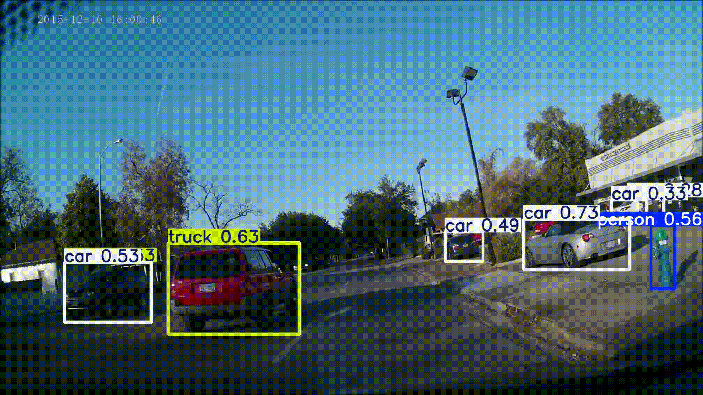

# VisionGuard: Real-Time Multi-Object Perception System


_**Figure 1:** VisionGuard processing a dashcam video in real-time, detecting and classifying vehicles and a person._

---

## 🚀 The Problem: The Eyes of an Autonomous Vehicle

For an autonomous vehicle to navigate the world safely, it must have a comprehensive and instantaneous understanding of its environment. This requires processing a complex video feed to answer critical questions simultaneously: What objects are nearby? Are they cars, trucks, or vulnerable pedestrians? What do upcoming traffic signs command?

Developing a system that performs this multi-object detection and classification with high accuracy and low latency is a foundational challenge in the autonomous driving industry.

## 💡 The Solution: A High-Performance Perception Engine

VisionGuard is a real-time perception system built in Python that serves as the "eyes" for an autonomous vehicle. It leverages the state-of-the-art **YOLOv8 (You Only Look Once)** model to perform high-speed, multi-object detection and classification on video streams.

The system processes video input frame-by-frame to produce a new, annotated video file, providing a clear and actionable view of the vehicle's surroundings.

### Key Features:
*   **State-of-the-Art AI Model:** Powered by **YOLOv8**, an industry-standard model renowned for its exceptional balance of speed and accuracy in real-time object detection.
*   **Multi-Object Detection:** Capable of identifying and tracking numerous object classes simultaneously, including cars, trucks, buses, and pedestrians.
*   **Real-Time Video Processing:** Utilizes **OpenCV** to efficiently read video streams, process frames, and write annotated output files, making it suitable for real-world applications.
*   **Clear Visual Output:** The system generates a new video file with clear bounding boxes, class labels, and confidence scores drawn onto each frame, providing an intuitive and powerful diagnostic tool.

---

## 🛠️ Technology Stack

*   **Core Language:** Python 3.12
*   **AI / Computer Vision:** Ultralytics YOLOv8, PyTorch
*   **Video & Image Processing:** OpenCV-Python

---

## 🏁 Getting Started

### Prerequisites
*   Python 3.12 or higher
*   Git

### Installation
1.  **Clone the repository:**
    ```bash
    git clone https://github.com/Zaid2044/VisionGuard-Perception-System.git
    cd VisionGuard-Perception-System
    ```

2.  **Create and activate a virtual environment:**
    ```bash
    # On Windows
    python -m venv venv
    venv\Scripts\activate
    ```

3.  **Install the required dependencies:**
    ```bash
    python -m pip install -r requirements.txt
    ```

### Running the Application
1.  **Place a test video** (e.g., dashcam footage) in the root of the project directory and name it `test_video.mp4`.

2.  **Run the detection script:**
    ```bash
    python detect_video.py
    ```
3.  An interactive window will display the real-time processing. Press 'q' to stop at any time.
4.  Once complete, the final annotated video will be saved as `output_video.mp4` in the project directory.